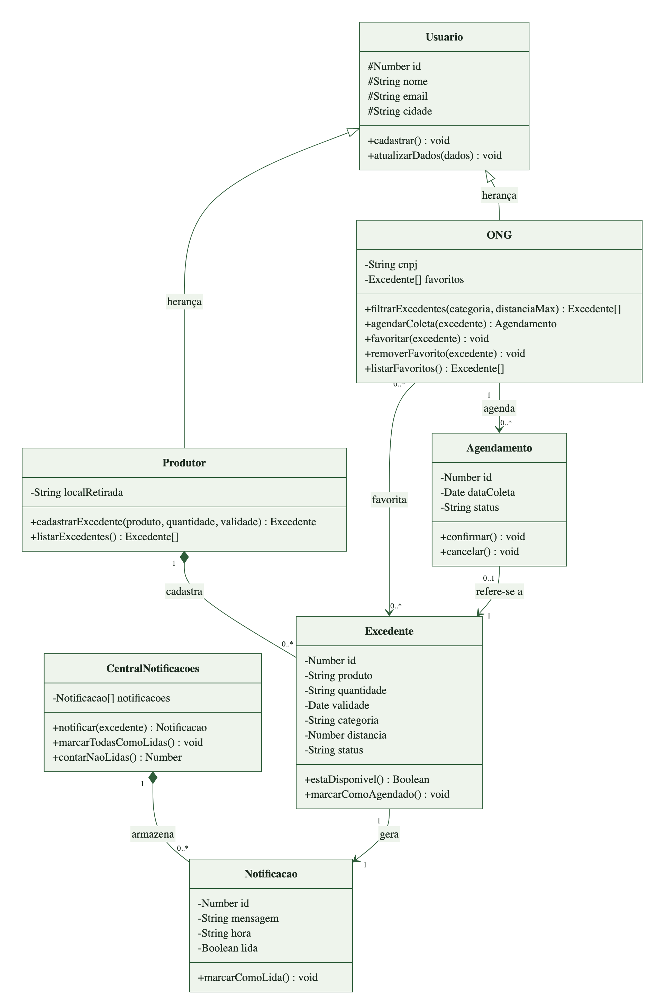

# Diagrama de classes UML - AgroHub Fase 6

Fonte editavel: [diagrama-classes.mmd](diagrama-classes.mmd) (Mermaid).
Imagem: [PNG](diagrama-classes.png) e [SVG](diagrama-classes.svg).

## O que o diagrama representa

E um modelo de dominio: mostra os objetos do negocio do AgroHub, o que cada um
guarda (atributos), o que cada um faz (metodos) e como se relacionam. O codigo
React usa componentes funcionais, hooks e objetos simples, sem `class`; a tabela
"Onde isso aparece no codigo" liga cada classe ao trecho que a implementa.

Esta versao substitui o diagrama anterior da Fase 6 para cobrir todos os itens
do enunciado: tres ou mais classes, atributos e metodos em todas elas, e
relacionamentos de heranca, composicao e associacao.

## Classes

| Classe | Atributos | Metodos |
| --- | --- | --- |
| Usuario | id, nome, email, cidade | cadastrar(), atualizarDados(dados) |
| Produtor (herda de Usuario) | localRetirada | cadastrarExcedente(produto, quantidade, validade), listarExcedentes() |
| ONG (herda de Usuario) | cnpj, favoritos | filtrarExcedentes(categoria, distanciaMax), agendarColeta(excedente), favoritar(excedente), removerFavorito(excedente), listarFavoritos() |
| Excedente | id, produto, quantidade, validade, categoria, distancia, status | estaDisponivel(), marcarComoAgendado() |
| Agendamento | id, dataColeta, status | confirmar(), cancelar() |
| CentralNotificacoes | notificacoes | notificar(excedente), marcarTodasComoLidas(), contarNaoLidas() |
| Notificacao | id, mensagem, hora, lida | marcarComoLida() |

## Relacionamentos

| Relacionamento | Tipo | Leitura |
| --- | --- | --- |
| Produtor -> Usuario | Heranca | Produtor e um Usuario: herda id, nome, email, cidade e cadastrar() |
| ONG -> Usuario | Heranca | ONG e um Usuario e acrescenta CNPJ, favoritos e as acoes do painel |
| Produtor 1 - 0..* Excedente | Composicao | O excedente so existe porque um produtor o cadastrou |
| CentralNotificacoes 1 - 0..* Notificacao | Composicao | As notificacoes existem dentro da central que as guarda |
| Excedente 1 - 1 Notificacao | Associacao | Cada excedente cadastrado gera uma notificacao |
| ONG 0..* - 0..* Excedente (favorita) | Associacao | Nova funcionalidade da Fase 6: a ONG salva excedentes para acompanhar |
| ONG 1 - 0..* Agendamento | Associacao | A ONG agenda coletas |
| Agendamento 0..1 - 1 Excedente | Associacao | Cada agendamento se refere a um excedente; um excedente tem no maximo um agendamento |

Notacao: `+` publico, `-` privado, `#` protegido (visivel nas classes filhas).
Triangulo vazio = heranca; losango cheio = composicao; seta simples = associacao.
Multiplicidade: `1` exatamente um, `0..1` no maximo um, `0..*` zero ou mais.

## Onde isso aparece no codigo

| Classe / metodo | Implementacao |
| --- | --- |
| Usuario, Produtor, ONG (dados de cadastro) | Abas Produtor, ONG e Usuario em `src/pages/Cadastro.jsx` |
| Produtor.cadastrarExcedente() | `handleSubmit` em `src/pages/Produtor.jsx`, que chama `addExcedente` |
| CentralNotificacoes | `NotificationsProvider` em `src/context/NotificationsContext.jsx` |
| notificar() / marcarTodasComoLidas() / contarNaoLidas() | `addExcedente`, `markAllAsRead`, `unreadCount` no provider |
| Notificacao.marcarComoLida() | campo `lida` atualizado por `markAllAsRead` |
| ONG.filtrarExcedentes() | `visibleItems` (filtro por categoria e distancia) em `src/pages/Ong.jsx` |
| ONG.agendarColeta() / Excedente.marcarComoAgendado() | `handleSchedule` e `scheduledIds` em `Ong.jsx` |
| ONG.favoritar() / removerFavorito() / listarFavoritos() | `toggleFavorite`, estado `favorites` e aba Salvos em `Ong.jsx` |
| ONG.favoritos | `favorites`, salvo no localStorage (`agrohub-ong-favorites`) |

## Roteiro curto para o pitch (cerca de 1 minuto)

1. "Modelamos o AgroHub com sete classes."
2. "Usuario e a classe base, com nome, email e cidade. Produtor e ONG herdam
   dela: isso e a heranca."
3. "O Produtor cadastra Excedentes. E uma composicao: o excedente so existe
   porque um produtor o cadastrou."
4. "Cada excedente gera uma Notificacao, que fica guardada na Central de
   Notificacoes. Essa foi a funcionalidade da Fase 5."
5. "A ONG se associa aos excedentes de duas formas: agenda coletas, criando um
   Agendamento, e - a novidade da Fase 6 - favorita os excedentes que quer
   acompanhar, com os metodos favoritar, removerFavorito e listarFavoritos."
